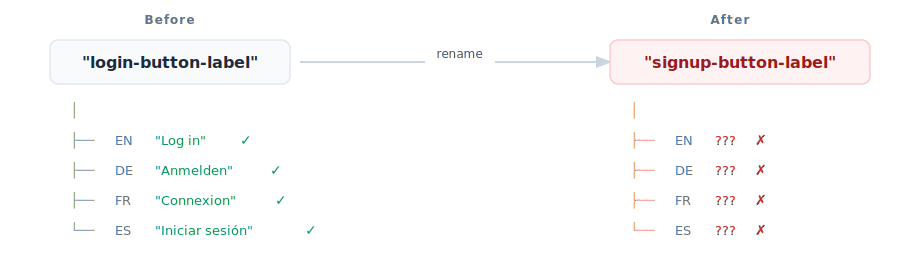
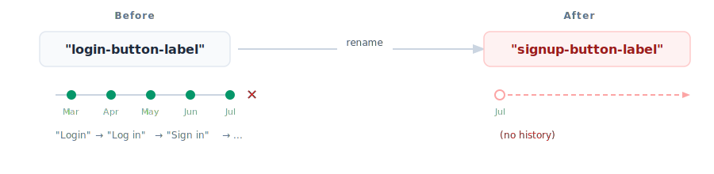

# Use Random Human-Readable Message Keys

Most i18n setups ask developers to name their message keys: `login-button-label`, `user.profile.title`. This seems sensible but causes problems. A better approach:

```diff
- "login-button-label"
+ "penguin_purple_shoe"
```

## The Problem with Semantic Keys

Most i18n libraries encourage semantic keys like `login.button.submit`.

The key encodes where the message “belongs” in the UI or codebase. In practice, semantic keys create two recurring problems.

### 1) Keys are unstable

Semantic keys _invite renaming_.

```diff
-login-button-label
+continue-button-label
```

- A “login” button becomes a “continue” button
- A component gets moved
- A designer changes copy

#### References break

Code pointing to `login-button-label` now points to nothing. Depending on your setup, this fails at runtime, falls back to a placeholder, or silently ships missing strings.

Furthermore, and more importantanly, the linkage between translations is broken.



#### History disappears

Translation history, comments, screenshots, QA notes, and reviewer context are usually tied to the key. Rename the key and you start over.



> ![NOTE]
> Tooling can mitigate this somewhat by tracking renames or fuzzy matching, but it’s complex and error-prone. The fundamental issue remains: keys are unstable.

### 2) Naming conventions are overhead

Semantic keys also create ongoing process cost:

- Teams bike-shed naming style (`snake_case` vs `kebab-case` vs `camelCase`)
- People argue about taxonomy (“is this `login` or `auth`?”)
- Developers spend time designing keys instead of shipping features

Your product rarely benefits from the _shape_ of the key - but your team pays for it repeatedly.


## The Solution: Human-Readable Random Keys

Instead of semantic keys, auto-generate IDs that are:

- **Stable**: never changes once created
- **Meaningless**: no naming debates, no “correctness” arguments
- **Human-readable**: easy to communicate and search (`penguin_purple_shoe`)

```
"penguin_purple_shoe"
```

A common approach is “three-word IDs” based on a word list (similar to what3words’ core idea of three-word identifiers, but for messages rather than locations).  
See: https://what3words.com/about

## The Tradeoff

You can't tell what a message contains from its key. `penguin_purple_shoe` says nothing about the text.

Without tooling, you'll grep through translation files. During code review, you'll see `m.penguin_purple_shoe()` and wonder what it says. That's friction.

Tooling removes this friction. An IDE extension like [Sherlock](https://inlang.com/m/r7kp499g/app-inlang-ideExtension) shows the message content inline:

```typescript
// IDE shows: "Log in to your account"
m.penguin_purple_shoe();
```

[Browse i18n tooling →](https://inlang.com/c/tools)

## How Other Libraries Handle This

Popular i18n libraries have arrived at the same conclusion: auto-generated keys are better than manual ones.

[FormatJS](https://formatjs.github.io/docs/getting-started/message-extraction), the library behind `react-intl`, explicitly discourages manual IDs:

> "Since manual IDs are discouraged, we've provided a babel plugin and a TypeScript AST transformer that will automatically insert message IDs in your transpiled code."

FormatJS generates hash-based IDs during extraction using patterns like `[sha512:contenthash:base64:6]`, producing short identifiers like `hak27d`. Their reasoning: manually assigned IDs create collision issues and maintenance burden.

See also [GitHub Issue #1892](https://github.com/opral/inlang/issues/1892) for our original design discussion on this topic.

## Why This Happens

The root cause: translations live in JSON files.

```json
{
  "login-button-label": "Log in"
}
```

In JSON, the key is both the identifier and the human-readable name. There's no separation. Rename the key, lose the reference. This is the fundamental problem.

In any database, you'd have an `id` column (stable) and maybe an `alias` column (human-readable). The translation content lives separately. But JSON files collapse everything into one field.

[Inlang](https://inlang.com) gives you both: an open file format like JSON, but with database semantics because it's SQLite under the hood:

```
Bundle (id: "purple_horse_lamp")
├── Message (locale: "en", text: "Log in")
├── Message (locale: "de", text: "Anmelden")
└── Message (locale: "fr", text: "Connexion")
```

The `id` is stable. Plugins handle import/export to JSON, XLIFF, or whatever format you need. But the source of truth is the database, not scattered JSON files.

[Learn more about inlang's architecture →](https://inlang.com/docs/architecture)

## Summary

| Semantic Keys               | Random Human-Readable Keys |
| --------------------------- | -------------------------- |
| References break on rename  | Stable references          |
| History lost on rename      | History preserved          |
| Naming conventions required | No conventions to enforce  |
| Devs must create keys       | Anyone can create messages |

_Related:_

- [GitHub Issue #1892](https://github.com/opral/inlang/issues/1892) - Original design discussion
