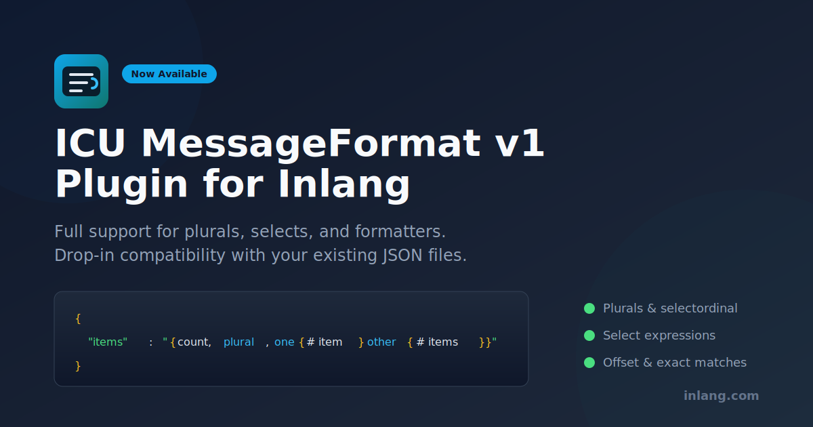

The ICU MessageFormat v1 plugin is now available for inlang. If your project uses ICU MessageFormat (the format behind `react-intl`, `@formatjs`, and many other i18n libraries), you can now use inlang's full tooling ecosystem.

## What's Supported

The plugin parses and exports ICU1 strings with full fidelity:

- **Plurals and selectordinal** including `offset` and exact matches (`=0`, `=1`)
- **Select expressions** for gender and other categorical choices
- **Formatter functions** like `number`, `date`, `time` with style parameters
- **Octothorpe `#`** substitution inside plural/selectordinal cases

```json
{
  "items": "{count, plural, offset:1 =0 {no items} one {# item} other {# items}}",
  "rank": "{place, selectordinal, one {#st} two {#nd} few {#rd} other {#th}}"
}
```

## Get Started

Add the plugin to your `project.inlang/settings.json`:

```json
{
  "modules": [
    "https://cdn.jsdelivr.net/npm/@inlang/plugin-icu1@latest/dist/index.js"
  ],
  "plugin.inlang.icu-messageformat-1": {
    "pathPattern": "./messages/{locale}.json"
  }
}
```

That's it. Your existing JSON files work immediately. No migration required.

[Read the full documentation](https://inlang.com/m/p7c8m1d2)
